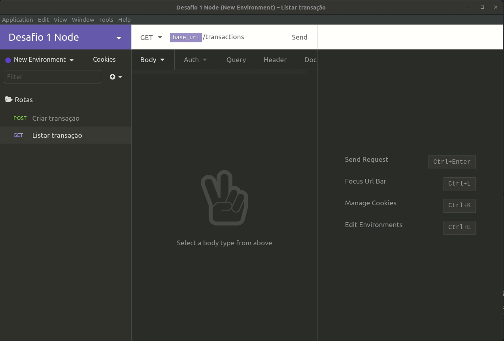

# primeiro-desafio-node-js
Primeiro desafio elaborado pela RocketSeat para exercitar os aprendizados de Node e TypeScript
<h2>Objetivo</h2>

O objetivo desse desafio foi desenvolver uma API Rest onde seria possivel realizar transações.
  O saldo deveria se iniciar zerado, e ser possivel gerar uma lista das transações realizadas, cada uma contentando um ID,
  Podendo ser do tipo income ou outcome, sendo impossivel realizar um saque superior ao valor em conta.

